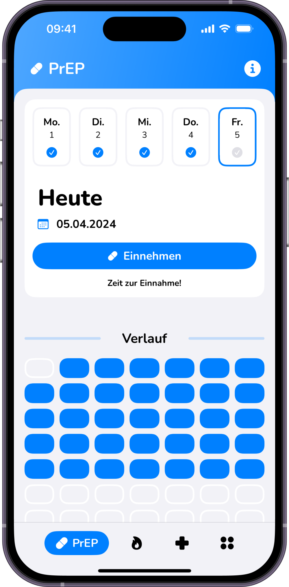

## EmigrateIn (Arbeitstitel, Name wird ggf. noch geändert)

**Gut vorbereitet auswandern – mit EmigrateIn.**

## Was bietet die App?

EmigrateIn ist dein persönlicher Begleiter für die Auswanderung mit Familie nach Südzypern. Die App bündelt alle wichtigen Informationen – von Visa-Bestimmungen über Behördengänge bis hin zu Wohnen und Schule – an einem zentralen Ort. Mit interaktiven Checklisten behältst du den Überblick über alle notwendigen Schritte während der Vorbereitung in Deutschland und den ersten Wochen nach deiner Ankunft auf Zypern.

## Für wen ist sie geeignet?

Die App richtet sich speziell an **deutsche Familien**, die planen, nach **Südzypern** auszuwandern oder gerade dort angekommen sind. Sie ist ideal für alle, die sich überfordert fühlen von der Fülle an Informationen und eine strukturierte Hilfe bei der Organisation ihres Umzugs suchen.

## Welches Problem löst sie?

Die Auswanderung mit Familie ist komplex und oft stressig. Informationen sind verstreut, schwer verständlich oder nicht aktuell. EmigrateIn löst das Problem der **Informationsüberflutung und der organisatorischen Unsicherheit**, indem es alle relevanten Schritte und Infos klar aufbereitet und in handhabbare Aufgaben unterteilt.

## Was macht die App anders/besser?

Im Gegensatz zu allgemeinen Foren oder Webseiten, konzentriert sich EmigrateIn **gezielt auf deutsche Familien und den Start in Südzypern**. Sie bietet nicht nur Informationen, sondern **verknüpft diese direkt mit praktischen, interaktiven Checklisten**. Besonderer Wert wird auf die **Verlässlichkeit der Informationen** gelegt, indem auf offizielle Quellen verwiesen und der Informationsstand transparent gemacht wird.

## Kern-Features (MVP V1.0 - Fokus: Deutsche Familien nach Südzypern)

- [ ] **Onboarding:** Nach dem Start durchläuft der Nutzer ein kurzes Onboarding. Über eine Hauptnavigation (z.B. Tab Bar) kann er auf die verschiedenen Info-Kategorien und Checklisten zugreifen. Informationen können gelesen, Checklistenpunkte abgehakt werden. Die Botschaftsinformationen werden dynamisch über eine API geladen.
- [ ] **Info-Hub**: Ein strukturierter Bereich mit aufbereiteten Informationen zu essenziellen Themen:
- Visa & Einreise *(MEU1/Yellow Slip, MEU2)*
- Ankunft & Erste Schritte *(Behördengänge: TIN, Sozialversicherung, GESY)*
- Wohnen *(Mieten/Kaufen Basics, Mietvertrag, Nebenkosten)*
- Bildung & Familie *(Schulsystem Überblick, Anmeldung Basics)*
- Gesundheitssystem *(GESY Überblick, Registrierung, Arztsuche Basics)*
- Kosten & Budget *(Statische Übersicht Lebenshaltungskosten, Einmalkosten)*
- Kontakte & Sicherheit *(Botschafts-Info, Notfallnummern, Hinweise zur Sicherheitsrecherche)*
- [ ] **Interaktive Checklisten:** Detaillierte, abharkbare Checklisten für die Phasen:
- Vorbereitung in Deutschland
- Ankunft & Erste Schritte in Zypern
- Speicherung des Fortschritts lokal `(SwiftData)` oder via Firebase Authentication.
- [ ] **Botschafts-Information:** Abruf und Anzeige der Kontaktdaten der Deutschen Botschaft in Nikosia über die OpenData-API des Auswärtigen Amtes `(travelwarning.api.bund.dev)`.
- [ ] **Fehlerbehandlung:** Nutzerfreundliche Anzeige von Fehlern *(z.B. bei Netzwerkproblemen oder API-Fehlern)* mittels Alerts.

## Design

  

## Technologie-Stack

- **Plattform:** iOS
- **Sprache:** Swift
- **UI-Framework:** SwiftUI
- **Architektur:** MVVM *(Model-View-ViewModel)*
- **Backend:** Google Firebase
  - Datenbank: Firestore *(für App-Inhalte wie Infos & Checklisten)*
  - Authentifizierung: Firebase Authentication *(Optional für MVP, z.B. zur Speicherung des Checklisten-Status)*
- **API-Anbindung:** `URLSession` mit `async/await` für den Aufruf der Auswärtiges-Amt-API.
- **Daten-Parsing:** `Codable`für JSON-Daten aus Firebase und der API.
- **Lokale Daten:** `SwiftData`für einfache Einstellungen oder Checklisten-Status.

#### Projektaufbau
Eine kurze Beschreibung deiner Ordnerstruktur und Architektur (MVVM, Repositories) um Außenstehenden zu helfen, sich in deinem Projekt zurecht zu finden.

#### Datenspeicherung
Welche Daten speicherst du? Wo und wie (Firebase, Core Data)? Erkläre hier auch, warum du den jeweiligen Dienst nutzt (offline-first, Sync usw.).

#### API Calls
Welche APIs verwendest du?

#### 3rd-Party Frameworks
Verwendest du Frameworks, die nicht von dir stammen? Bspw. Swift Packages für Firebase, fertige SwiftUI-Views o.Ä.? Gib diese hier an.

## Projektbeschreibung & Ausblick

EmigrateIn ist eine native iOS-App, die als Minimum Viable Product (MVP) im Rahmen des **Abschlussprojekts Modul 3 - App-Entwicklung iOS - am Syntax Institut** entwickelt wird.

### Geplante zukünftige Erweiterungen

- [ ] **Community-Features:** Forum oder Chatgruppen zum Austausch zwischen Auswanderern.
- [ ] **Interaktiver Budgetplaner:** Detailliertes Tool zur Finanzplanung.
- [ ] **Verzeichnisse:** Listen mit geprüften Kontakten (Ärzte, Anwälte, Makler, Übersetzer etc.).
- [ ] **Erweiterte Inhalte:** Detailliertere Infos zu "Arbeiten als Angestellter", Firmengründung, Steuern etc.
- [ ] **Zusätzliche Tools:** Basis-Vokabeltrainer (Griechisch), "Fakten über Zypern".
- [ ] **Weitere Länder:** Ausweitung der Inhalte auf andere beliebte Auswanderungsziele.
- [ ] **Erweiterte Nutzerprofile & Anbieter-Plattform:** Möglichkeit für erfahrene Expats, Dienste anzubieten.

## Autor

**Dominik Baki**, Student am **Syntax Institut** im Kurs Fachkraft für App-Entwicklung (iOS & Android).
